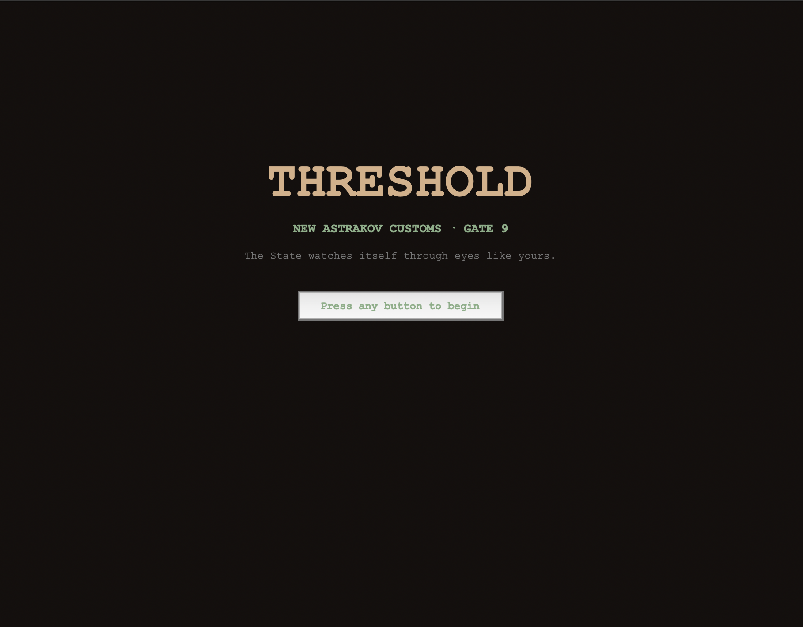
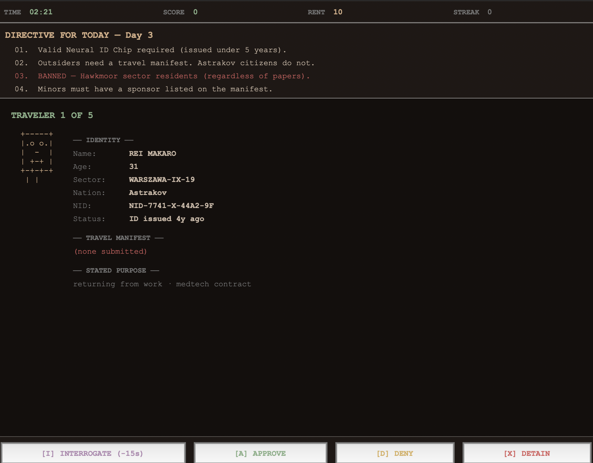
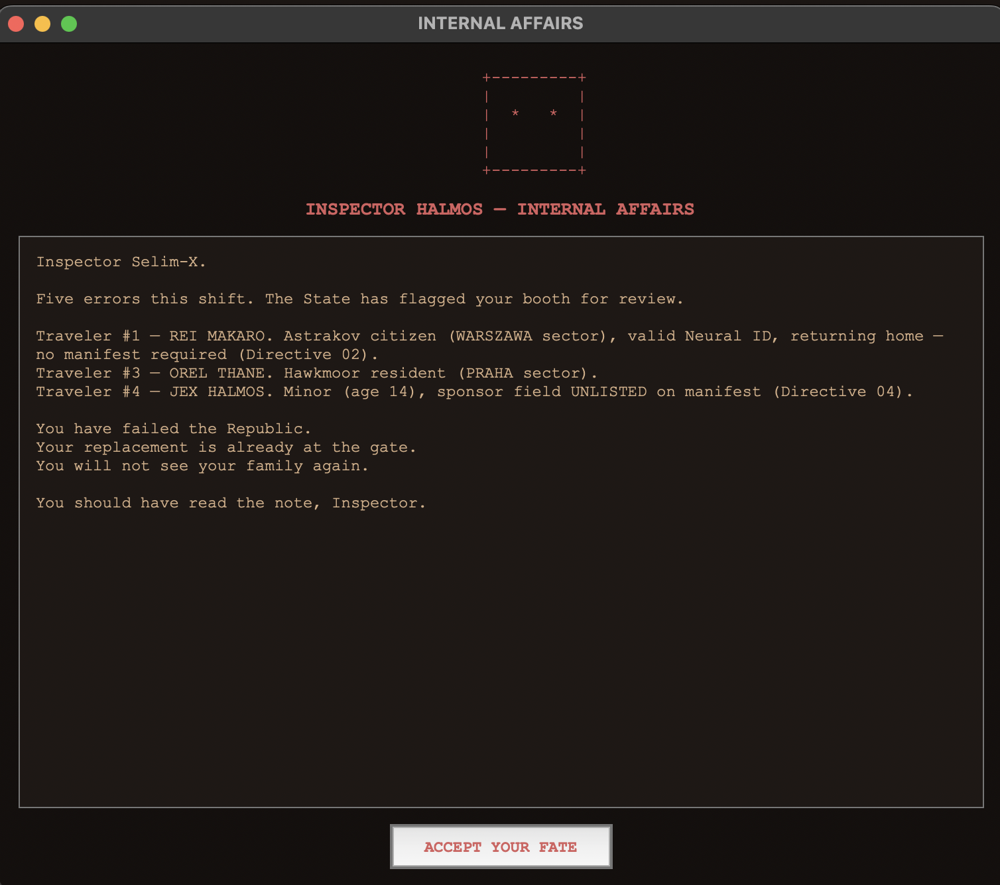

# THRESHOLD

THRESHOLD is a cyberpunk customs-interrogation game inspired by *Papers,
Please*. The player is Inspector Selim-X at Gate 9 of New Astrakov, a sealed
city-state in 2077. Across a single real-time 5:00 shift, the player processes
five travelers: reading their documents against the day's State directives,
interrogating the suspicious ones, and ruling approve, deny, or detain on each.
Mistakes cost rent and accumulate against the player. The shift resolves into
one of three endings — PROMOTED, CONTINUE THE SHIFT, or ARRESTED — the last of
which inverts the premise: Inspector Halmos arrives, reads the player's own
wrong verdicts back to them, and the player must accept their fate.

## Screenshots







## How to run

Two run modes. Both require Python 3.10+.

### CLI version (recommended for any terminal)

```bash
python3 main.py
```

No dependencies — standard library only. The terminal needs to support ANSI
colors (any modern Linux/macOS terminal, or Windows Terminal). Polish
diacritics render via UTF-8.

### GUI version (tkinter)

```bash
python3 main_gui.py
```

Requires a Python build with tkinter (the standard `python3` on Ubuntu, macOS
system Python, and the Windows installer ships with it). Some pyenv-built
interpreters omit tkinter; if you see `ModuleNotFoundError: No module named
'_tkinter'`, run with a system Python or rebuild your interpreter against
Tcl/Tk.

## Gameplay

- One shift, five travelers, a 5:00 countdown clock.
- Four actions per traveler: Approve, Deny, Detain, and Interrogate (max two
  questions per traveler, -15s each).
- After each verdict, its reason — why it was correct, wrong, or a moral
  violation — lingers for 8 seconds before the next traveler steps up.
- A note arrives between travelers one and two — read it (-5s) or ignore it.
  The choice changes Halmos's final line if the player is arrested.
- The wounded refugee (Orel Thane): the directives say deny, but conscience may
  say otherwise. Approving costs less rent than other errors yet still counts
  as a violation.
- The bribe (Ven Narith): accept it on the third interrogation question for +2
  rent and a darker promoted ending.
- Three consecutive errors or five total errors trigger an arrest. Halmos
  reads the player's wrong verdicts aloud, and the player must ACCEPT YOUR FATE.

## Architecture

- **exceptions.py** — custom exception hierarchy: a `ThresholdError` base with
  validation errors and control-flow signals.
- **models/** — pure data classes with validation at construction
  (Traveler/Document/Permit, Directive/RuleSet, Question/InterrogationSession,
  ShiftState/WrongVerdict).
- **core/** — game logic: the validator (rule engine), lie detector
  (regex-based contradiction detection), clock (threaded real-time countdown),
  internal_affairs (arrest sequence with generator-based speech), verdict
  (end-of-shift scoring), and catalog (JSON loader).
- **storage/** — a generic JSON repository and serializer pair.
- **data/** — game content as JSON (travelers, directives, dialogue).
- **cli/** — terminal presentation: theme constants, custom decorators
  (`@log_action`, `@reveal_slowly`), pure rendering functions, and the main
  game loop with match-case dispatch.
- **gui/** — tkinter presentation: shared theme constants, reusable widgets,
  and a main window orchestrating the same flow as the CLI.

Both presentation layers consume the same domain modules. No game rules are
duplicated between `cli/` and `gui/`.

## Key design decisions

- **Composition over inheritance** — a Traveler has-a Document and has-a
  Permit rather than subclassing them.
- **Validation at the boundary** — constructors reject invalid data, so
  downstream code can trust every object it receives.
- **Functional core, imperative shell** — the validator and lie detector are
  pure functions; `ShiftState` owns all mutation.
- **Custom exception hierarchy with a sealed root** — a single `ThresholdError`
  base keeps top-level handling clean.
- **Dispatch table for rules** — the `RULE_CHECKERS` dict maps `rule_id`
  strings to checker functions, making a new rule a one-line addition.
- **Generator for dramatic speech** — `generate_review_speech` yields lines
  lazily, letting each consumer (CLI or GUI) control pacing.
- **Two entry points, one domain** — the GUI reuses every `core/` and `models/`
  module without re-implementing a single rule.

## Python features used

- Classes with `__init__` validation, `__repr__`, and methods.
- A custom exception hierarchy.
- Generators (`yield`, `yield from`).
- Decorators, including parameterized decorators and `@functools.wraps`.
- Regular expressions: compiled patterns, `re.IGNORECASE`, `\b` word boundaries.
- List, dict, and set comprehensions.
- Lambdas for `sorted(key=...)`.
- `match-case` for action dispatch.
- `with open(...)` context managers for file I/O.
- JSON serialization with `ensure_ascii=False` for UTF-8.
- `pathlib.Path` for portable paths.
- `threading.Thread` and `threading.Event` for the background clock.
- `tkinter` for the GUI: `Tk`/`Toplevel`, `grid`/`pack`, `after()`-based
  scheduling, and `grab_set()` for modal dialogs.

## Project conventions

- All file I/O is UTF-8 with `ensure_ascii=False`, so Polish diacritics in
  sector names (POZNAŃ, KRAKÓW, and others) render natively.
- Action logging goes to `data/actions.log` via the `@log_action` decorator on
  game-entry functions.

